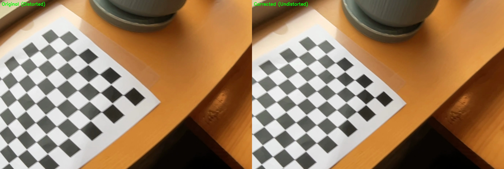

# Camera Calibrator

OpenCV를 활용한 카메라 캘리브레이션 도구입니다. 체스보드 패턴을 이용하여 카메라 내부 파라미터를 추정하고 렌즈 왜곡을 보정합니다.

## 데모 미리보기

### 입력 원본 영상 미리보기 (GIF)


입력 원본 영상 (LFS): `input/왜곡심한버전.mov`

### 왜곡심한버전 비교 프레임



### 왜곡심한버전 비교 미리보기 (GIF)


원본 영상이 필요한 경우 로컬에서 확인:

- 보정 영상(H.264): `output/왜곡심한버전_undistorted_h264.mp4`
- 비교 영상(H.264, 좌: 원본, 우: 보정): `output/왜곡심한버전_comparison_h264.mp4`

## 주요 기능

- 체스보드 패턴을 이용한 카메라 캘리브레이션
- 이미지 및 동영상의 렌즈 왜곡 보정
- 실시간 왜곡 보정 미리보기

## 요구 사항

- Python 3.7 이상
- OpenCV (`pip install opencv-python`)
- NumPy (`pip install numpy`)

## 빠른 시작

### 설치

```bash
pip install opencv-python numpy
```

### 사용법

#### 1. 카메라 캘리브레이션 실행

```bash
python camera_calibration.py chessboard.avi --board-size 9,6 --square-size 25.0
```

#### 2. 왜곡 보정 적용

```bash
# 이미지 왜곡 보정
python distortion_correction.py calibration_result.json -i image.jpg -o output/

# 동영상 왜곡 보정
python distortion_correction.py calibration_result.json -i video.mp4 -o output/

# 과보정 완화(권장): strength를 0.85~0.95로 조절
python distortion_correction.py calibration_result.json -i 왜곡심한버전.mov -o output/ --alpha 0.6 --strength 0.92

# 실시간 미리보기
python distortion_correction.py calibration_result.json --live

# GitHub용 경량 GIF 미리보기 생성 (비교 영상 기준, 6초)
ffmpeg -y -ss 00:00:02 -t 6 -i output/왜곡심한버전_comparison_h264.mp4 \
	-vf "fps=10,scale=900:-1:flags=lanczos,split[s0][s1];[s0]palettegen=max_colors=128[p];[s1][p]paletteuse=dither=bayer" \
	output/왜곡심한버전_preview.gif

# GitHub용 경량 GIF 미리보기 생성 (입력 원본 기준, 5초)
ffmpeg -y -ss 00:00:02 -t 5 -i input/왜곡심한버전.mov \
	-vf "fps=8,scale=720:-1:flags=lanczos,split[s0][s1];[s0]palettegen=max_colors=96[p];[s1][p]paletteuse=dither=bayer" \
	output/왜곡심한버전_input_preview.gif
```

#### 전체 파이프라인 실행

```bash
python run_all.py
```

---

## 카메라 캘리브레이션 결과

### 내부 파라미터 (Camera Matrix)

| 파라미터 | 값 |
|----------|------|
| fx (초점 거리 x) | 9453.59 pixels |
| fy (초점 거리 y) | 8115.38 pixels |
| cx (주점 x) | 809.50 pixels |
| cy (주점 y) | 539.50 pixels |

### 왜곡 계수

| 파라미터 | 값 |
|----------|------|
| k1 (방사 왜곡) | -5.838306 |
| k2 (방사 왜곡) | -2556.235080 |
| p1 (접선 왜곡) | 0.275973 |
| p2 (접선 왜곡) | -0.083448 |
| k3 (방사 왜곡) | 34850.216052 |

### 캘리브레이션 품질

- **RMSE (재투영 오차)**: 1.114798 pixels
- **사용된 이미지 수**: 46
- **이미지 크기**: 1620 x 1080
- **모델**: standard

---

## 작동 원리

### 카메라 캘리브레이션

1. **체스보드 검출**: 여러 이미지/프레임에서 체스보드 내부 코너 검출
2. **코너 정밀화**: `cv2.cornerSubPix()`를 사용하여 서브픽셀 단위로 코너 위치 정밀화
3. **캘리브레이션**: `cv2.calibrateCamera()`로 카메라 행렬과 왜곡 계수 계산
4. **오차 계산**: 재투영 오차(RMSE)를 계산하여 캘리브레이션 품질 평가

### 왜곡 보정

1. **캘리브레이션 로드**: JSON 파일에서 카메라 행렬과 왜곡 계수 로드
2. **왜곡 보정**: `cv2.undistort()` 또는 `cv2.remap()`으로 렌즈 왜곡 보정
3. **결과 저장**: 보정된 이미지/동영상 저장 (비교 이미지 포함)

---

## 체스보드 패턴

캘리브레이션을 위해 표준 체스보드 패턴을 사용합니다:

- **권장 패턴**: 9x6 내부 코너 (10x7 사각형)
- **출력 크기**: A4 용지
- **다운로드**: [Calibration Checkerboard Collection](https://markhedleyjones.com/projects/calibration-checkerboard-collection)

### 좋은 캘리브레이션을 위한 팁

1. 출력한 패턴을 **평평하고 단단한 표면**에 부착
2. 촬영 시 **다양한 각도와 거리** 사용
3. 체스보드로 **전체 프레임**을 다양하게 커버
4. 코너 검출을 위해 **충분한 조명** 확보
5. 다양한 자세로 **20-30초** 정도 촬영

---

## 파일 구조

```
my_camera_calibrator/
├── input/                  # 원본 입력 영상
│   └── *.mov
├── camera_calibration.py    # 카메라 캘리브레이션 스크립트
├── distortion_correction.py # 왜곡 보정 스크립트
├── run_all.py              # 전체 파이프라인 실행
├── calibration_result.json # 캘리브레이션 결과 (자동 생성)
├── output/                 # 보정된 이미지/동영상 (자동 생성)
│   ├── *_undistorted.mp4
│   ├── *_comparison.mp4
│   ├── *_comparison_frame.jpg
│   ├── *_input_preview.gif
│   └── *_preview.gif
└── README.md
```

---

## 참고 자료

- [OpenCV 카메라 캘리브레이션 튜토리얼](https://docs.opencv.org/4.x/dc/dbb/tutorial_py_calibration.html)
- [Zhang의 카메라 캘리브레이션 방법](https://www.microsoft.com/en-us/research/wp-content/uploads/2016/02/tr98-71.pdf)

